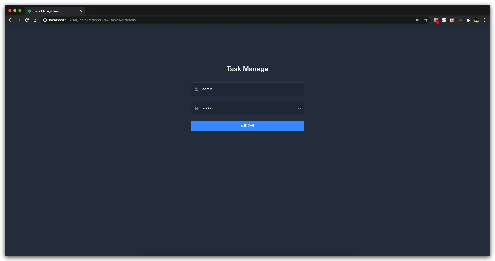
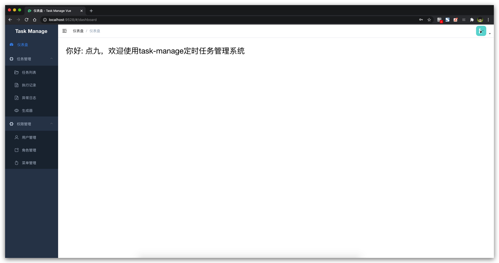
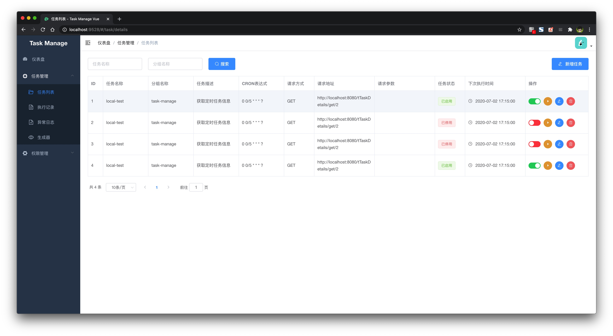
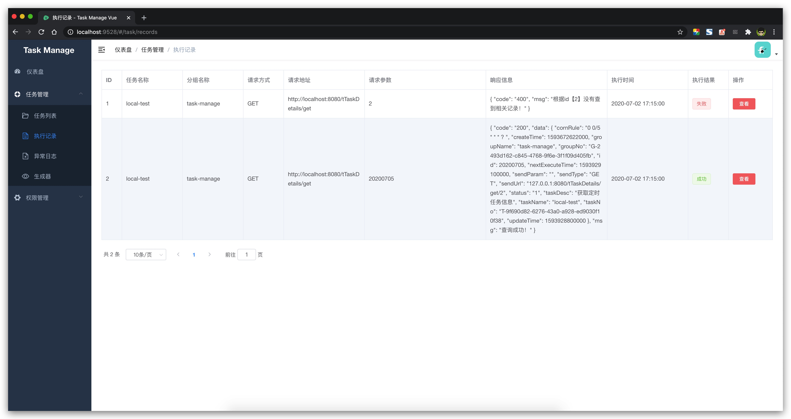
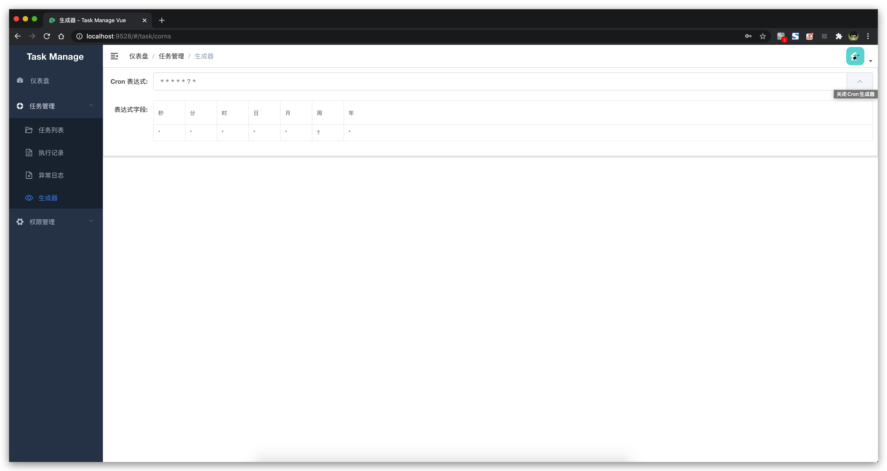
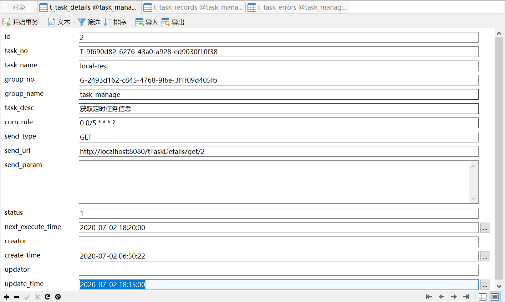
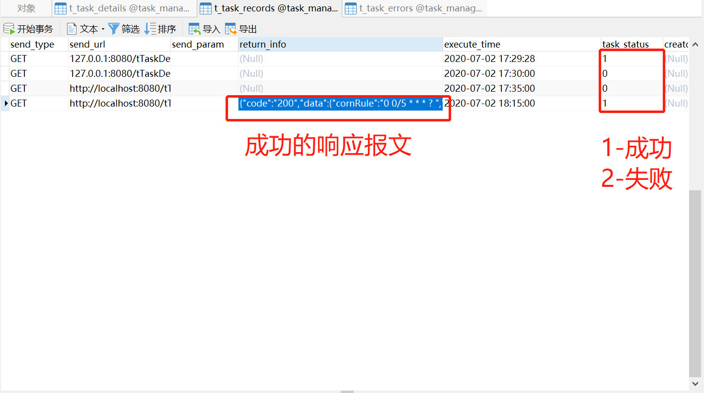
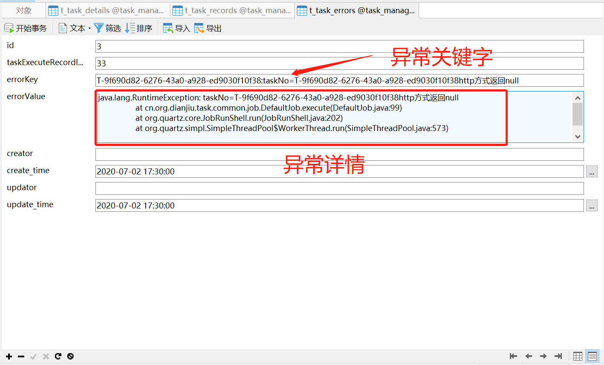

# Task Manage
 
> 基于SpringBoot的轻量级定时任务管理系统

      
 
[https://github.com/dianjiu/task-manage](https://github.com/dianjiu/task-manage)

[https://gitee.io/dianjiu/task-manage](https://gitee.io/dianjiu/task-manage)

## 相关项目 task-manage-vue

> 基于Vue的Task Manage的后管UI

      

https://github.com/dianjiu/task-manage-vue

https://gitee.io/dianjiu/task-manage-vue

## 技术选型  
- springboot 2.3.1
- SpringSecurity 2.3.1
- httpclient 4.5.12
- quartz 2.3.2
- druid 1.1.22
- fastjson 1.2.71

## 项目功能
1. 架构潮流：系统采用SpringBoot+VUE前后端分离，前端单独部署，Nginx负载均衡
2. 接口友好：同时支持swagger2、knife4j两种可视化接口API调试，支持离线接口文档；
3. 任务管理：支持通过Web页面对任务进行CRUD操作，可视化界面，快速上手；
4. 执行记录：支持通过web页面在线查看调度结果、执行结果、下次执行时间；
5. 实时日志：支持通过web页面实时查看执行器输出的完整的执行日志；
6. 唯一搜索：支持通过web界面根据jobname或jobgroup进行全局唯一查询
7. 强自定义：支持在线配置定时任务请求类型、请求路径、请求参数、Cron表达式，即时生效；
8. 动态控制：支持动态修改任务状态、启动/停止任务，以及终止运行中任务，即时生效；
9. 执行策略：支持丰富的执行策略，包括：Get请求、PostJson请求、PostFrom表单请求；
10. 自动注册：周期性自动注册任务, 同时，也支持手动录入定时任务地址；
11. 自动执行：系统会自动发现注册的任务并触发执行，同时，也支持手动触发-立即执行；
12. 用户管理：支持在线管理系统用户、角色、菜单，默认管理员、开发者、普通用户三种角色；
13. 权限控制：支持在线权限控制，管理员拥有全量权限，开发者拥有除角色管理外的所有权限，普通用户仅支持任务管理相关权限；
14. 集群部署：支持分布式执行，系统支持集群部署，可保证任务执行的高可用；
15. 弹性调度：一旦有任务机器上线或者下线，下次调度时将会重新分配任务；
16. 路由策略：系统集群部署时提供丰富的路由策略，包括：轮询、随机、故障转移、忙碌转移等常用策略；
17. 故障转移：任务路由策略选择"故障转移"情况下，如果集群中某一台机器故障，将会自动切换到一台正常的执行器发送调度请求；
18. 阻塞策略：调度过于密集执行器来不及处理时的处理策略，策略包括：单机串行（默认）、丢弃后续调度、覆盖之前调度；
19. 超时控制：支持自定义任务超时时间，任务运行超时将会主动中断任务；
20. 重试机制：支持自定义任务重试次数，当任务失败时将会按照预设的失败重试次数主动进行重试；
21. 消息工厂：默认提供邮件工厂的方式推送消息，同时预留扩展接口，可方便的扩展短信、钉钉等消息方式；
22. 邮件告警：任务失败时支持邮件报警，支持配置多邮件地址群发报警邮件；
23. 运行报表：支持实时查看运行数据，以及调度报表，如调度日期分布图，任务组执行比例比例分布图等；
24. 事件触发：除了"Cron方式"和"任务依赖方式"触发任务执行之外，提供触发任务单次执行的API服务；
25. 脚本任务：支持以GLUE分布式平台开发和运行脚本任务，包括Shell、Python、NodeJS等类型脚本;
26. 多线并发：系统支持多线程触发调度运行，确保调度精确执行，不被堵塞；
27. 降级隔离：调度线程池进行隔离拆分，慢任务自动降级进入"Slow"线程池，避免耗尽调度线程，提高系统稳定性；
28. Gradle: 将会把最新稳定版推送到gradle中央仓库, 方便用户接入和使用;
29. Maven: 将会把最新稳定版推送到maven中央仓库, 方便用户接入和使用;
30. 一致性：基于Redis分布式锁保证集群分布式调度的最终一致性, 一次任务调度只会触发一次执行；
31. 全异步：任务调度流程全异步化设计实现，如异步调度、异步运行、异步回调等，有效对密集调度进行流量削峰，理论上支持任意时长任务的运行；
32. 跨语言：系统提供语言无关的 RESTFUL API 服务，第三方任意语言可据此对接Task Manage；
33. 国际化：后管系统支持国际化设置，提供中文、英文两种可选语言，默认为中文；
34. 容器化：提供官方docker镜像，并实时更新推送dockerhub，进一步实现产品开箱即用；

## 开发进度
- [x] 架构潮流：系统采用SpringBoot+VUE前后端分离，前端单独部署，Nginx负载均衡
- [x] 接口友好：同时支持swagger2、knife4j两种可视化接口API调试，支持离线接口文档；
- [x] 任务管理：支持通过Web页面对任务进行CRUD操作，可视化界面，快速上手；
- [x] 执行记录：支持通过web页面在线查看调度结果、执行结果、下次执行时间；
- [x] 实时日志：支持通过web页面实时查看执行器输出的完整的执行日志；
- [x] 唯一搜索：支持通过web界面根据jobname或jobgroup进行全局唯一查询；
- [x] 强自定义：支持在线配置定时任务请求类型、请求路径、请求参数、Cron表达式，即时生效；
- [x] 动态控制：支持动态修改任务状态、启动/停止任务，以及终止运行中任务，即时生效；
- [x] 执行策略：支持丰富的执行策略，包括：Get请求、PostJson请求、PostFrom表单请求；
- [x] 自动注册：周期性自动注册任务, 同时，也支持手动录入定时任务地址；
- [x] 自动执行：系统会自动发现注册的任务并触发执行，同时，也支持手动触发-立即执行；
- [x] 用户管理：支持在线管理系统用户、角色、菜单，默认管理员、开发者、普通用户三种角色；
- [x] 权限控制：支持在线权限控制，管理员拥有全量权限，开发者拥有除角色管理外的所有权限，普通用户仅支持任务管理相关权限；
- [ ] 集群部署：支持分布式执行，系统支持集群部署，可保证任务执行的高可用；
- [ ] 弹性调度：一旦有任务机器上线或者下线，下次调度时将会重新分配任务；
- [ ] 路由策略：系统集群部署时提供丰富的路由策略，包括：轮询、随机、故障转移、忙碌转移等常用策略；
- [ ] 故障转移：任务路由策略选择"故障转移"情况下，如果集群中某一台机器故障，将会自动切换到一台正常的执行器发送调度请求；
- [ ] 阻塞策略：调度过于密集执行器来不及处理时的处理策略，策略包括：单机串行（默认）、丢弃后续调度、覆盖之前调度；
- [ ] 超时控制：支持自定义任务超时时间，任务运行超时将会主动中断任务；
- [ ] 重试机制：支持自定义任务重试次数，当任务失败时将会按照预设的失败重试次数主动进行重试；
- [ ] 消息工厂：默认提供邮件工厂的方式推送消息，同时预留扩展接口，可方便的扩展短信、钉钉等消息方式；
- [ ] 邮件告警：任务失败时支持邮件报警，支持配置多邮件地址群发报警邮件；
- [ ] 运行报表：支持实时查看运行数据，以及调度报表，如调度日期分布图，任务组执行比例比例分布图等；
- [x] 事件触发：除了"Cron方式"和"任务依赖方式"触发任务执行之外，提供触发任务单次执行的API服务；
- [ ] 脚本任务：支持以GLUE分布式平台开发和运行脚本任务，包括Shell、Python、NodeJS等类型脚本;
- [ ] 多线并发：系统支持多线程触发调度运行，确保调度精确执行，不被堵塞；
- [ ] 降级隔离：调度线程池进行隔离拆分，慢任务自动降级进入"Slow"线程池，避免耗尽调度线程，提高系统稳定性；
- [ ] Gradle: 将会把最新稳定版推送到gradle中央仓库, 方便用户接入和使用;
- [ ] Maven: 将会把最新稳定版推送到maven中央仓库, 方便用户接入和使用;
- [ ] 一致性：基于Redis分布式锁保证集群分布式调度的最终一致性, 一次任务调度只会触发一次执行；
- [ ] 全异步：任务调度流程全异步化设计实现，如异步调度、异步运行、异步回调等，有效对密集调度进行流量削峰，理论上支持任意时长任务的运行；
- [x] 跨语言：系统提供语言无关的 RESTFUL API 服务，第三方任意语言可据此对接Task Manage；
- [x] 国际化：后管系统支持国际化设置，提供中文、英文两种可选语言，默认为中文；
- [ ] 容器化：提供官方docker镜像，并实时更新推送dockerhub，进一步实现产品开箱即用；  

## 部署方式
1. 执行sql目录下的task_manage.sql文件，建立task_manage需要的数据库表  
2. 修改application-local.yml中的数据库连接方式
3. 通过ftp上传task-manage-1.0-SNAPSHOT.jar、start.sh、stop.sh到服务器指定目录
4. 进入服务器目录，执行 nohup sh start.sh & 命令启动成功
5. 查看程序启动进程 netstat -anp | grep 18080
6. 访问 http://localhost:18080/idnex.html 可通过web界面进行定时任务的管理

## 在线演示

http://task.dianjiu.org.cn   (部署中。。。)

## 项目图片

### 页面演示
> 登录页

> 仪表盘

> 任务管理 =》任务列表

> 任务管理 =》执行记录

> 任务管理 =》生成器 （关闭cron生成器）

> 任务管理 =》生成器 （打开cron生成器）

### 数据库演示

> 任务信息表

> 执行记录表

> 异常信息表

## 更新日志
[Task Manage 项目介绍](https://www.yuque.com/dianjiu/wgebfo/oxc244)

[Task Manage 更新日志](https://www.yuque.com/dianjiu/wgebfo/fgz9x8)

[Task Manage 分布式ID的思考](https://www.yuque.com/dianjiu/wgebfo/oo97xh)

[Task Manage 执行策略的思考](https://www.yuque.com/dianjiu/wgebfo/zip7y0)

## 关于点九
[个人站点](https://dianjiu.co)

## 最后致谢
感谢以下开源项目提供的项目参考
- https://github.com/ElemeFE/element
- https://gitee.com/lindeyi/vue-cron
- https://github.com/xuxueli/xxl-job
- https://gitee.com/52itstyle/spring-boot-task
- https://github.com/helloflygit/springboot-quartz
- https://github.com/simonsfan/springboot-quartz-demo
- https://github.com/PanJiaChen/vue-admin-template

